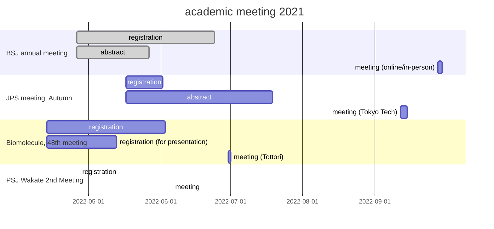

# Schedule 2022

## ACADEMIC MEETING

List of URL

- [JPS](https://www.jps.or.jp/english/)
- [BSJ](https://www2.aeplan.co.jp/bsj2022/index.html)
- [biomol48](https://sites.google.com/tottori-u.ac.jp/biomol48/)
- [PSJ Wakate](https://www2.aeplan.co.jp/pssj2022/wakate_koryu.html)

