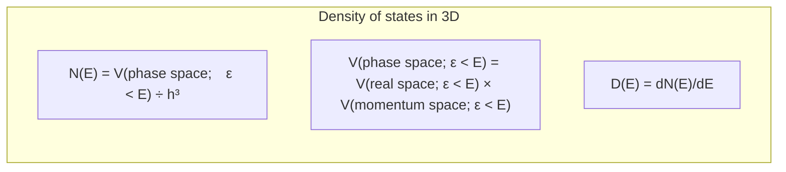

# Density of States

Nov. 22, 2021
Nov. 23, 2021

T. Yamato@NU

## Particle in a square well

Let us consider a particle confined in one-dimensional space, $x=[0, L]$, with an infinite square well potential. 

We can easily get the eigenstates and eigenenergies as 
$$
\begin{align}
\Psi (x) &= \sqrt{\frac{２}{L}}\sin\left(\frac{n\pi x}{L}\right), \\ \epsilon &= \frac{n^2 \pi^2 \hbar^2}{2mL^2} \;(n=1, 2, 3, \cdots) \tag{1}
\end{align}
$$  

If you extend this to three dimensions, then the energy eigenvalues become, 
$$
\epsilon = \frac{\pi^2 \hbar^2}{2mL^2}(n_x^2+n_y^2+n_z^2). \tag{2}
$$
We can rewrite this as
$$
(n_x^2 + n_y^2 + n_z^2) = \frac{2m\epsilon L^2}{\pi^2 \hbar^2}. \tag{3}
$$
Let us consider the state space $(n_x, n_y, n_z)$. The L.H.S. of (Eq. 3) represents the squared distance, $r^2$, of the grid point $(n_x, n_y, n_z)$ from the origin. In this space, we find one grid point per each cubic element of volume 1 (= 1 x 1 x 1). Accordingly, the one-eighth of the volume of the sphere of radius $r$ represents the number of states, $N(\epsilon)$, with energy $< \epsilon$. Note that that the factor of 1/8 is needed because only positive integers $n_x, n_y, n_z$, are allowed.
$$
N(\epsilon) = \frac{1}{8}\frac{4\pi}{3}\left( \frac{2m \epsilon L^2}{\pi^2 \hbar^2} \right)^{3/2} \tag{4}
$$
Then the density of states, $D(\epsilon)$, is obtained by taking the derivative of $N(\epsilon)$ with respect to $\epsilon$, where $V=L^3$ is the real space volume of this system.
$$
D(\epsilon) = \frac{Vm^{3/2}}{\sqrt 2 \pi^2 \hbar^3}\epsilon^{1/2} \tag{5}
$$

## Phase space (p, q)

Another approach is possible to obtain the density of states for the system we considered above based on the phase space volume, which is represented as the product of (real space volume) and (momentum space volume). Due to the uncertainty principle, we are not allowed to tell the exact location of the state, $(p, q)$, in the phase space. Let us assume that this resolution limit be $\eta$, where $\eta$ represents the volume of the smallest cell "visible" in the phase space. Then, we can count the number of possible states available in the phase space by dividing the (volume of the phase space) by ($\eta$). As we shall see later, $\eta$ is equal to $h^3$, where $h$ is Plank's constant.

In this section, we calculate the volume of the phase space for the state with energy $\epsilon$ to $\epsilon + d\epsilon$, and divid this volume by $\eta$ to get the density of states, $D(\epsilon)$. 
Let us consider a free particle with energy $\epsilon = \frac{p^2}{2m}$ moving in 3D space of volume $V$. Since $\epsilon$ does not depend on $\rm \bf{q}$, the avilable real space volume simply becomes $V$. On the other hand, we need to consider the $p$-dependence of $\epsilon = p^2 / 2m$ for the momentum space volume. The volume of the spherical shell of radius $p$ to $p + dp$ is $4 \pi p^2 dp$ in the momentum space. Using $d\epsilon = \frac{p}{m}dp$, we obtain the density of states as 
$$
D(\epsilon)d\epsilon = \frac{V}{\eta}\cdot 4\pi p^2 dp = \frac{4\sqrt{2}\pi Vm^{3/2}}{\eta}\epsilon^{1/2}d\epsilon.  \tag{6}
$$
By comparing Eqs. (5) and (6), we see that $\eta$ is equal to $h^3$.

## Phase space (k, q)

We can reproduce the previous result Eq. (6) by considering the wavenumber space instead of the momentum space in a similar manner using $p = \hbar k$.