# Grand canonical ensemble

Nov. 8, 2021
Note by Prof. Kawasaki based on Callen
Ed. T. Yamato

$$
\begin{eqnarray}
P_i &=& \frac{W(E_T - E_i, N_T - N_i)}{W(E_T, N_T)} \\
\rm{numerator} &=& e^{\frac{1}{k_B}S(E_T - U+U-E_i,N_T - N + N - N_i)} \\
&\approx& e^{\frac{1}{k_B}S(E_T-U, N_T-N)+\frac{\partial S}{\partial E}(U-E_i)+\frac{\partial S}{\partial N}(N-N_i)} \\
&=& e^ {\frac{1}{k_B}S(E_T-U, N_T-N)+\frac{1}{T}(U-E_i)-\frac{\mu}{T}(N-N_i) } \\
\rm{denominator} &=& e^{\frac{1}{k_B}S(E_T, N_T)} \\
&=& e^{\frac{1}{k_B}S(E_T-U+U, N_T-N+N)} \\
&=& e^{\frac{1}{k_B}S(E_T-U, N_T-N)+ S(U, N)} (\; \because \; S: \rm{extensive \; variable)} \\
P_i &=& \frac{e^{\frac{1}{k_B T}(U-E_i)}e^{\frac{-\mu}{k_B T}(N-N_i)}}{e^{\frac{1}{k_B}S(U,N)}} \\
&=& e^{\beta(U-ST-\mu N)}e^{-\beta(E_i - \mu N)} \\
&=& e^{\beta \Omega}e^{- \beta(E_i - \mu N_i)} \\
&=& \frac{1}{\Xi} e^{- \beta (E_i - \mu N_i)}

\end{eqnarray}
$$
