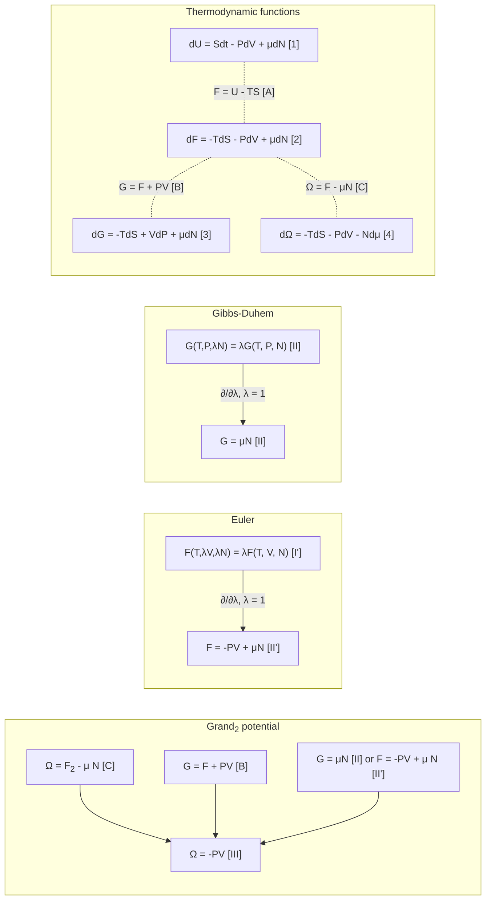

# Thermodynamic functions

Nov. 1, 2021
T. Yamato@NU

```mermaid
graph LR
subgraph "Grand<sub>2</sub> potential"
EC["&Omega; = F<sub>2</sub> - &mu; N [C]"]-->EIII["&Omega; = -PV [III]"]
EB["G = F + PV [B]"]-->EIII
EIIdash["G = &mu;N [II] or F = -PV + &mu; N [II']"]-->EIII
end
subgraph Euler
EI'["F(T,&lambda;V,&lambda;N) = &lambda;F(T, V, N) [I']"]-->|"&part;/&part;&lambda;, &lambda; = 1"|EII'["F = -PV + &mu;N [II']"]
end
subgraph Gibbs-Duhem
EI["G(T,P,&lambda;N) = &lambda;G(T, P, N) [II]"]-->|"&part;/&part;&lambda;, &lambda; = 1"|EII["G = &mu;N [II]"]
end
subgraph Thermodynamic functions
E1["dU = Sdt - PdV + &mu;dN [1]"]-.-|"F = U - TS [A]"|E2["dF = -TdS - PdV + &mu;dN [2]"]
E2-.-|"G = F + PV [B]"|E3["dG = -TdS + VdP + &mu;dN [3]"]
E2-.-|"&Omega; = F - &mu;N [C]"|E4["d&Omega; = -TdS - PdV - Nd&mu; [4]"]
end
```
