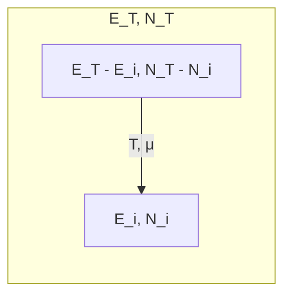

# Grand canonical ensemble

Nov. 8, 2021
After Prof. Kawasaki (based on Callen)
Ed. T. Yamato

```mermaid
graph LR 
  subgraph "E_T, N_T"
    Environemnt["E_T - E_i, N_T - N_i"]-->|"T, &mu;"|ParitialSystem[E_i, N_i]
  end
```

