# Thermal conductivity

Ref: McQuarrie "Statistical Physics"

[Diffusion equation]

$$
\tilde{E} \equiv U - \left<U\right>, \tag{1} \\\\
U: \rm{Internal\:energy}\:[J]
$$

$$
\rho\tilde{E} = \tilde{E}/V: \rm{Energy\:density} \tag{2}
$$

$$
\rho \frac{\partial \tilde{E}}{\partial t}+ \nabla \cdot \mathbf{h} = 0: \rm{Continuity\:equation} \tag{3} \\\\
\mathbf{h}: \rm{heat\:current\:vector}
$$

$$
\mathbf{h} = - \lambda \nabla T : \rm{Fourier's\: law} \tag{4}
$$

$$
\lambda : \rm{thermal\:conductivity} \left[\frac{W}{m \cdot K}\right]
$$

$$
\tilde{E} = c_vT + \rm{const.} \tag{5} \\\\
c_v: \rm{specific\: heat\: at\: constant\: volume}
$$

(4) $\rightarrow$​(3)

$$
\rho \frac{\partial \tilde{E}}{\partial t}-\lambda \nabla^2T=0 \tag{6}
$$

(5)$\rightarrow$ (6)

$$
\rho c_v \frac{\partial T}{\partial t}- \lambda\nabla^2T = 0 \\\\
\rm{or} \\\\
\rho \frac{\partial \tilde{E}}{\partial t}- \frac{\lambda}{c_v}\nabla^2E = 0 \\\\
\rm{Heat\:diffusion\:equation} \tag{7}
$$

Fourier transformation

$$
L(\mathbf{k}, t) \equiv \frac{1}{\sqrt{2\pi}^3}\iiint_\mathbf{r} \tilde{E}(\mathbf{r},t)\exp(-i\mathbf{k}\cdot\mathbf{r})d\mathbf{r} \tag{8}
$$

Inverse Fourier transformation

$$
\tilde{E}(\mathbf{r},t) = \frac{1}{\sqrt{2\pi}^3}\iiint_{\mathbf{k}}L(\mathbf{k},t)\exp(i\mathbf{k}\cdot\mathbf{r})d\mathbf{k} \tag{9}
$$

(9)$\rightarrow$​(7)

$$
\rho c_v\frac{\partial L}{\partial t} = - \lambda k^{2}L \tag{10}
$$

For a system consisting of $N$ particles,

$$
\tilde{E}(\mathbf r,t)=\sum_{j=1}^{N}\tilde{E}\delta(\mathbf{r}-\mathbf{r}_j) \tag{11}
$$

Without loss of generality, we can take $\mathbf{k}$ in the $z$-direction (in other words, we assume that heat flows along the $z$-direction), then

$$
\begin{eqnarray}
L(\mathbf{k}, t)&=&\sum_{j=1}^{N}\tilde{E_j}e^{i\mathbf{k}\cdot\mathbf{r}_j(t)} \\\\
&=& \sum_{j=1}^{N} \tilde{E_j}e^{ikz_j(t)} \tag{12}
\end{eqnarray}
$$

(11)$\rightarrow$​​(10) and evaluate $\left<\rm{L.H.S.}\times{L^*(\mathbf{k},0)}\right>=\left<\rm{R.H.S.}\times{L^*(\mathbf{k},0)}\right>$​, then we get:

$$
\left<\sum_{j=1}^{N}\sum_{l=1}^{N}\tilde{E}_j(0)\tilde{E}_l(t)e^{ik[z_l(t)-z_j(0)]}\right> = \left<\tilde{E}_j(0)\tilde{E}_l(0)e^{ik[z_l(0)-z_j(0)]}\right>\exp\left(\frac{-\lambda k^2 t}{\rho c_v}\right) \tag{13}
$$

In equilibrium ensemble, {$\tilde{E}$}​s and {$z$}​s​​ are independent in the pre-expnential factor in R.H.S. of Eq. (13), therefore, 

$$
\begin{align*}
\left<\sum_{j=1}^N\sum_{l=1}^{N}\tilde{E}_j(0)\tilde{E}_l(0)e^{ik[z_l(0)-z_j(0)]}\right>
&= \left<\sum_{j=1}^N\sum_{l=1}^{N}\tilde{E}_j(0)\tilde{E}_l(0)\cdot\delta_{jl}\cdot e^{ik[z_l(0)-z_j(0)]}\right> \\\\
&= \left<\sum_{j=1}^N\sum_{l=1}^{N}\tilde{E}_j(0)\tilde{E}_l(0)\right> \\\\
&= \left< (U-\left<U\right>)^2 \right>  k_B T^2c_v
\tag{14}
\end{align*}
$$

Here we used the folloing relation:

$$
\begin{eqnarray}
c_v &=& \frac{\partial U}{\partial T} = \frac{\partial}{\partial T}
\left( 
  \frac{ \sum_j \epsilon_j e^{-\beta \epsilon_j} } { \sum_{j} e^{-\beta \epsilon_j} } 
\right) \\\\ 
&=& \frac{
  \left( \frac{\partial}{\partial T} \left(\sum_j \epsilon_j e^{-\beta \epsilon_j} \right) \right) \left( \sum_{j} e^{-\beta \epsilon_j} \right) - 
  \left(\sum_j \epsilon_j e^{-\beta \epsilon_j} \right) \frac{\partial}{\partial T}\left( \sum_{j} e^{-\beta \epsilon_j} \right)
}{
  (\sum_{j} e^{-\beta \epsilon_j})^2
} \\\\
&=& \left( \frac{-1}{k_B T^2} \right) \frac{
  -\sum_j \epsilon_j^2 e^{-\beta \epsilon_j}\left(\sum_{j} e^{-\beta \epsilon_j} \right)
  +\left( \sum_j \epsilon_j^2 e^{-\beta \epsilon_j} \right)^2
}{
  (\sum_{j} e^{-\beta \epsilon_j})^2
} \\\\
&=& \frac{-1}{k_B T^2}\left<U^2-\left<U\right>^2\right> \\\\
&=& \frac{-1}{k_B T^2}\left< \left(U-\left<U\right>\right)^2\right>
\tag{15}
\end{eqnarray}
$$

where,

$$
\frac{\partial}{\partial T}
= \frac{\partial}{\partial \beta}\frac{\partial \beta}{\partial T}
= -\frac{-1}{k_B T^2}\frac{\partial}{\partial T}.
$$

L.H.S. of Eq. (13) can be expanded as :

$$
\begin{equation}
\left< \sum_{j=1}^{N}\sum_{l=1}^{N}\tilde{E}_j(0)\tilde{E}_l(t)\right> + ik \left< \sum_{j=1}^{N}\sum_{l=1}^{N}\tilde{E}_j(0)\tilde{E}_l(t)[z_l(t)-z_j(0)] \right> + \frac{k^2}{2}\left< \sum_{j=1}^{N}\sum_{l=1}^{N}\tilde{E}_j(0)\tilde{E}_l(t)[z_l(t)-z_j(0)]^2 \right> + \cdots \tag{16}
\end{equation}
$$

By using energy conservation $(\sum_{l=1}^{N}\tilde{E}_l(t))=\sum_{l=1}^{N}\tilde{E}_l(0))$​​, the first term of (16) becomes:

$$
\left< \sum_{j=1}^{N}\sum_{l=1}^{N}\tilde{E}_j(0)\tilde{E}_l(t)\right> = \left< \sum_{j=1}^{N}\sum_{l=1}^{N}\tilde{E}_j(0)\tilde{E}_l(0)\right> = k_B T^2 c_v \tag{17}
$$

The second term of (16) is expanded as:

$$
ik \left< \sum_{j=1}^{N}\sum_{l=1}^{N}\tilde{E}_j(0)\tilde{E}_l(t)z_l(t) \right> -
ik \left< \sum_{j=1}^{N}\sum_{l=1}^{N}\tilde{E}_j(0)\tilde{E}_l(t)z_j(0) \right> \tag{18}
$$

Due to energy conservation, we can substitute $\tilde E_{j(0)}$​​​​ of the first term in (18) with  $\tilde E_{j(t)}$​​​​. Furthermore, due to stationaity of the ensemble, the first term in (18) becomes $ik \left< \sum_{j=1}^{N}\sum_{l=1}^{N}\tilde{E}_j(0)\tilde{E}_l(0)z_l(0) \right>$​​​​. Likewise,  the second term in (18) can be written as $ik \left< \sum_{j=1}^{N}\sum_{l=1}^{N}\tilde{E}_j(0)\tilde{E}_l(0)z_l(0) \right>$​​​​ because we can substitute  $\tilde{E}_l(t)$​​​​ with  $\tilde{E}_l(0)$​​​​​ due to energy conservation. Consequently, we see that the  second term is (18) vanishes.  

The third term in (16) is expanded as:

$$
\left< \sum_{j=1}^{N}\sum_{l=1}^{N}\tilde{E}_j(0)\tilde{E}_l(t)(z_l(t))^2 \right> 
\- 2\left< \sum_{j=1}^{N}\sum_{l=1}^{N}\tilde{E}_j(0)\tilde{E}_l(t)z_l(t)z_j(0) \right>
\+ \left< \sum_{j=1}^{N}\sum_{l=1}^{N}\tilde{E}_j(0)\tilde{E}_l(t)(z_j(0))^2 \right> \tag{19}
$$

The first term of (19) can be written as:

$$
\begin{eqnarray}
\left<
  \sum_{j=1}^{N}\sum_{l=1}^{N}\tilde{E}_j(t)\tilde{E}_l(t)(z_l(t))^2
\right>
&=& \left<
  \sum_{j=1}^{N}\sum_{l=1}^{N}\delta_{jl}\tilde{E}_j(0)\tilde{E}_l(t)(z_l(t))^2
\right> \\\\
&=& \left<
  \sum_{j=1}^{N}\sum_{l=1}^{N}(\tilde{E}_j(t))^2(z_j(t))^2
\right>
\end{eqnarray}
$$

$$
\because \sum_{j=1}^N\tilde{E}_j(0)
= \sum_{j=1}^N\tilde{E}_j(t) \rm{\:\: energy\: conservation}
$$

The second term of (19) can be written as :

$$
-2\left<
  \sum_{j=1}^{N}\sum_{l=1}^{N}\delta_{jl}\tilde{E}_j(0)\tilde{E}_l(t)z_j(0)z_l(t)
\right>
= -2 \left<
  \sum_{j=1}^{N}\tilde{E}_j(0)\tilde{E}_j(t)z_j(0)z_j(t)
\right>
$$

And the third term of (19) becomes:

$$
\left< \sum_{j=1}^{N}(\tilde{E}_j(0))^2(z_j(0))^2 \right>
$$

Consequently, (19) is written as:

$$
\left< \left[\tilde{E}_j(t)z_j(t) - \tilde{E}_j(0)z_j(0) \right]^2\right> \tag{20}
$$

where we denote $\sum_{j=1}^{N}\tilde{E}(t)z_j(t)$ as $A(t)$ which corresponds to "energy distribution". Then,

$$
A(t) - A(0) = \int_0^t dt'J(t')
$$

where $J(t)$​, heat current, is defined as the time-derivative of energy distribution. 

$$
\left(A(t)-A(0)\right)^2 = \int_0^t dt'\int_0^t dt'' J(t')J(t'')
$$

$$
\left<
  \left[ A(t)-A(0) \right]^2
\right>
= \int_0^t dt'\int_0^t dt''\left<J(t')J(t'')\right>
$$

where we denote $\left<J(t')J(t'')\right>$​ as $\phi(t'-t'')$ which only depends on the time difference $t'-t''$. Then, (20) can be written as:

$$
\begin{eqnarray}
\int_0^t dt'\int_0^t dt'' \phi(t'-t'') &=& \int_0^t dt' \int_0^{t'} dt'' \phi(t'-t'') + \int_0^t dt' \int_{t'}^t dt'' \phi(t'- t'') \\\\
&=& \int_0^t dt' \int_0^{t'} dt'' \phi(t'-t'') + \int_0^t dt'' \int_{0}^{t''} dt' \phi(t'- t'') \\\\
&=& \int_0^t dt' \int_0^{t'} dt'' \phi(t'-t'') + \int_0^t dt' \int_{0}^{t'} dt'' \phi(t''- t) \\\\
&=& \int_0^t dt' \int_0^{t'} dt'' [\phi(\tau) + \phi(-\tau)] \\\\
&=& 2\int_0^t dt' \int_{t'}^{0} (-d\tau) \phi(\tau) \\\\
&=& 2\int_0^t dt' \int_0^{t'} d\tau \phi(\tau) \\\\
&=& 2\int_0^t d\tau \int_{\tau}^{t} dt' \phi(\tau) \\\\
&=& 2\int_0^t d\tau (t-\tau)\phi(\tau) \tag{21}
\end{eqnarray}
$$

, where $\tau \equiv t'-t''$ and the respective domain of integration are 

(I) L.H.S. of the first line:

(II) the first term of R.H.S. of the first line:

(III) the second term of R.H.S. of the first line:

(IV) the second term of R.H.S. of the second line:

(V) R.H.S. of the sixth line:

(VI) R.H.S. of the seventh line:

We swapped the integration variable $t' \leftrightarrow t''$ in the second term of R.H.S. of the third line, and used the time reversibility of $\phi(\tau)$ in R.H.S. of the fourth line. We changed the variable of integration from $t''$ to $\tau$ from the fourth to the fifth line. Note that $t'$ and $\tau$ are independent variables and therefore $\phi(\tau)$ does not depend on $t'$. 

Consequently, Eq. (13) can be written as:

$$
k_B T^2 c_v - \frac{k^2}{2}\cdot 2\int_0^{\tau}d\tau (t-\tau)<J(0)J(\tau)> = k_B T^2 c_v \left(1 - \frac{\lambda k^2 t}{\rho c_v} + \cdots \right) \tag{22}
$$

, where R.H.S. of Eq. (22) is the Taylor expansion of the exponential term of R.H.S. of Eq. (13). By rewriting Eq. (22) with taking the limit of $t \rightarrow \infty$,  we obtain:

$$
\begin{eqnarray}
\lambda &=& \frac{\rho}{k_B T^2} \lim_{t \rightarrow \infty} \int_0^t \left(1 - \frac{\tau}{t}
\right) \left<J(\tau)J(0) \right> d\tau
&=& \frac{1}{Vk_B T^2} \lim_{t \rightarrow \infty} \int_0^t \left<J(\tau)J(0) \right> d\tau \tag{23}
\end{eqnarray}
$$

, where we assumed fast decay of $\left<J(t)J(0) \right>$. Here we considered three dimensional isotropic fluid, and the heat current$J = \frac{d}{dt} \sum_{j=1}^{N}\tilde{E}_jz_j$ corresponds to the $z$-component, $h_z$, of three dimensional heat current vector $(h_x, h_y, h_z) = \mathbf{h} \equiv \frac{d}{dt} \sum_{j=1}^{N}\tilde{E}_j \mathbf{r}_j$, where $h_x = h_y = h_z$ due to isotropy. Accordingly, we can rewrite Eq. (23) as:

$$
\lambda = \frac{1}{3Vk_BT^2}\lim_{t\rightarrow\infty}\int_0^t\left<\mathbf{h}(0)\cdot \mathbf{h}(\tau) \right>d\tau \tag{24}
$$
