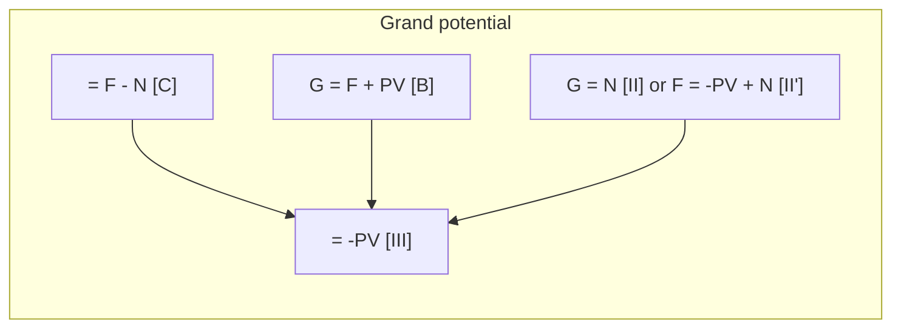

```mermaid
graph LR
    A-->B
```

```mermaid
graph LR
    subgraph Grand potential
    EC[" = F -  N [C]"]-->EIII[" = -PV [III]"]
    EB["G = F + PV [B]"]-->EIII
    EIIdash["G = N [II] or F = -PV + N [II']"]-->EIII
end
```

