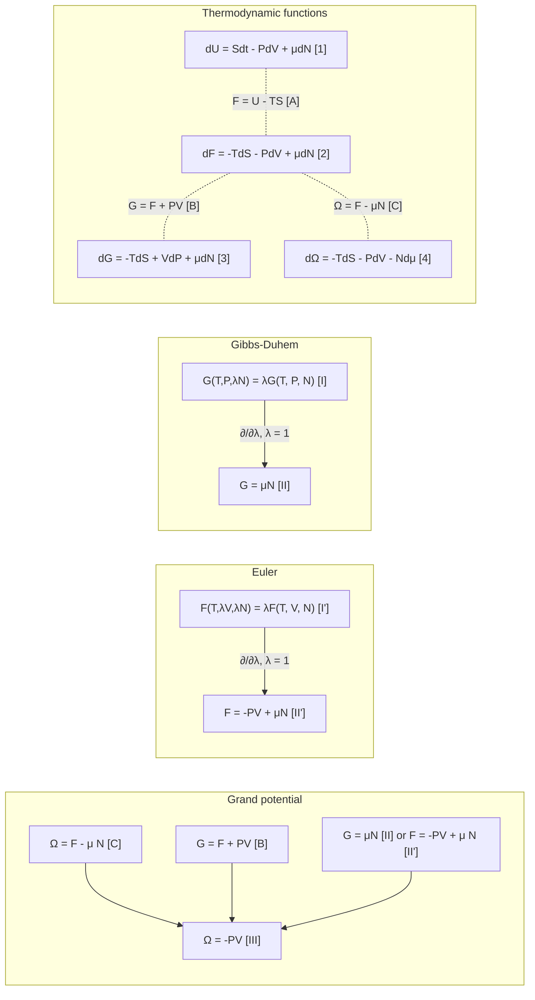

# Thermodynamic functions

ver.1: Nov. 1, 2021

ver.2: Nov. 9, 2021

T. Yamato@NU

Proof of Gibbs-Duhem 

$$
\left(\frac{\partial G}{\partial {\lambda N}} \frac{\partial (\lambda N)}{\partial \lambda}\right)_{\lambda=1} = \mu N = G(T, P, N)
$$
