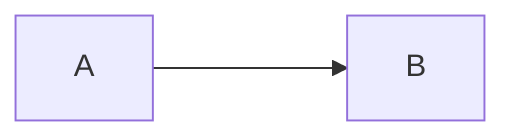
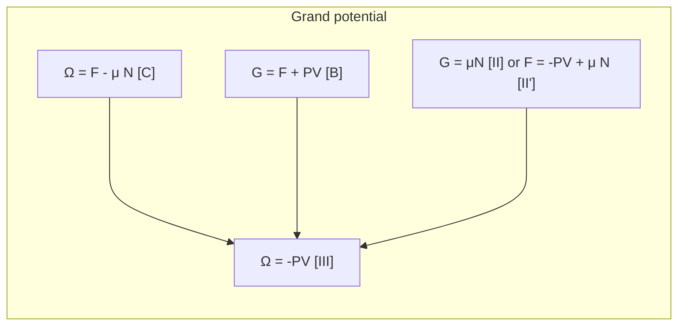

# Thermodynamic functions

test

```mermaid
graph LR
A--->B
```

```mermaid
graph LR
subgraph Grand potential
EC["&Omega; = F - &mu; N [C]"]--->EIII["&Omega; = -PV [III]"]
EB["G = F + PV [B]"]--->EIII
EIIdash["G = &mu;N [II] or F = -PV + &mu; N [II']"]--->EIII
end
```

