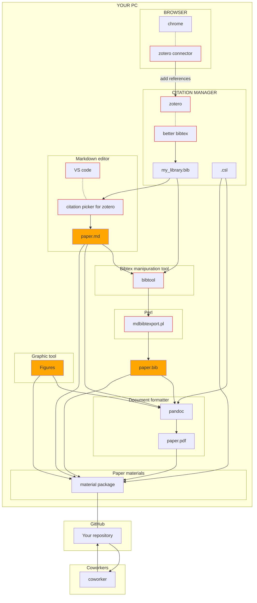

# writing paper

```mermaid
graph TB
subgraph YOUR PC

subgraph BROWSER
A[chrome]-.-B[zotero connector]
click B "https://www.zotero.org/support/connector"
end

subgraph CITATION MANAGER
C[zotero]-.-D[better bibtex]
click C "https://www.zotero.org"
click D "https://retorque.re/zotero-better-bibtex/"
D-->E[my_library.bib]
I[<journal>.csl]
end

subgraph Markdown editor
F[VS code]-.-G[citation picker for zotero]
click F "https://code.visualstudio.com"
click G "https://marketplace.visualstudio.com/items?itemName=mblode.zotero"
G-->H[paper.md]
end

subgraph Document formatter
J[pandoc]-->BB[paper.pdf]
end

subgraph Bibtex manipuration tool
AA[bibtool]
click AA "http://www.gerd-neugebauer.de/software/TeX/BibTool/en/"
end

subgraph Graphic tool
P[Figures]
end

subgraph Perl
AAA[mdbibtexport.pl]
click AAA "https://github.com/robert-winkler/mdbibexport"
end

E-->AA
H-->AA
AA-->AAA
AAA-->N[paper.bib]
B-->|"add references"|C
E-->G

H-->J
I-->J
P-->J
N-->J

subgraph Paper materials
A3[material package]
end

H-->A3
I-->A3
P-->A3
N-->A3
BB-->A3

end

subgraph GitHub
A1[Your repository]
end

subgraph Coworkers
A2[coworker]
end

A3---A1
A1-->A2
A2-->A1

style B stroke: red
style C stroke: red
style D stroke: red
style F stroke: red
style G stroke: red
style AA stroke: red
style AAA stroke: red
style H fill:orange
style N fill:orange
style P fill:orange
```