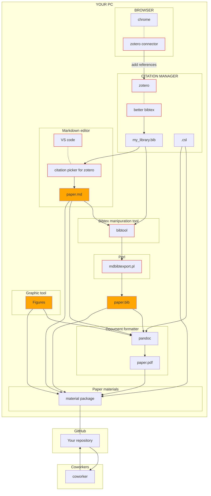

# writing paper

## Introduction
Productive environment for writing paper is very important for every scientist. Nowadays, we usually work with many coworkers with different backgrounds from different locations. Therefore, we need to exchange our ideas/comments/opinions in an efficient manner. For instance, *GitHub* provides an ideal solution for this purpose. 

For writing papers, we usually use documentation tools such as MS-WORD, Latex, etc... Although your manuscript with either WORD or Latex format will be accepted by most scientific journals without any problem, it does not provide an ideal resource especially when you write a paper with your colleagues together. 

Markdown text is getting more and more popular especially among data scientists and computer programmers. Recently, there are so many useful Markdown editors, such as *Visual Studio code*, *Typora*, etc... available for us. Here I will show my recent effort to write scientific paper with *VS code* with using Citation Manager *Zotero*. 

Here I show our attempt to write scientific paper with markdown text and share relevant materials via GitHub with your coworkers (see below). Note that you can visit clickable links indicated by red boxes below.

## Citation manager and Browser
I was using *Mendeley* before migrating to *Zotero*, the latter of which seems to be more useful for us. By using *Better Bibtex* extention with *Zotero*, you can automatically keep updating your `.bib` file that contains your personal reference library. When you use, for instance, *Google chrome* for finding a scientific paper you wish to add to your library, you can easily cite the reference in your manuscript by using *Zotero connector* extension for *Google chrome*. 

## Editing markdown text
*VS code* is one of the most popular markdown editors, today. By using *Citation picker for Zotero* extension, you can select a reference from your Zotero library and cite the reference at any position in your paper. Usually, your original reference library, `my_library.bib`, kept by *Zotero* contains huge amount of references. Therefore, it is not suitable to be shared with your coworkers. By using `bibtool` and a perl script, `mdbibtexport.pl`, you can extract the references that appear in your markdown file, `paper.md`, and save it as, for instance, `paper.bib`. These two files constitute the essential part of your paper. Also, you will need specify a suitable citation style, which is described in a file with `.csl` extension. For instance, *Nature* citation style is described in `nature.csl`. Finally, you can generate a PDF file, `paper.pdf` from `paper.md`, `paper.bib`, and `<journal>.csl` files, using *Pandoc* document formatter. Of course, you may wish to include links to original figures in the markdown text. You can use, for instance, *draw.io* to create an *svg* file for your paper. A care must be taken however, in such cases. For example, an *svg* figure containing text may not be converted to PDF file by *Pandoc*. Anyway, you can push your paper materials including `paper.md`, `paper.bib`,`<journal>.csl`, and original figure files, to your github repository so that you can share these materials with your coworkers. Of course, you can include the pdf file of your paper as well.