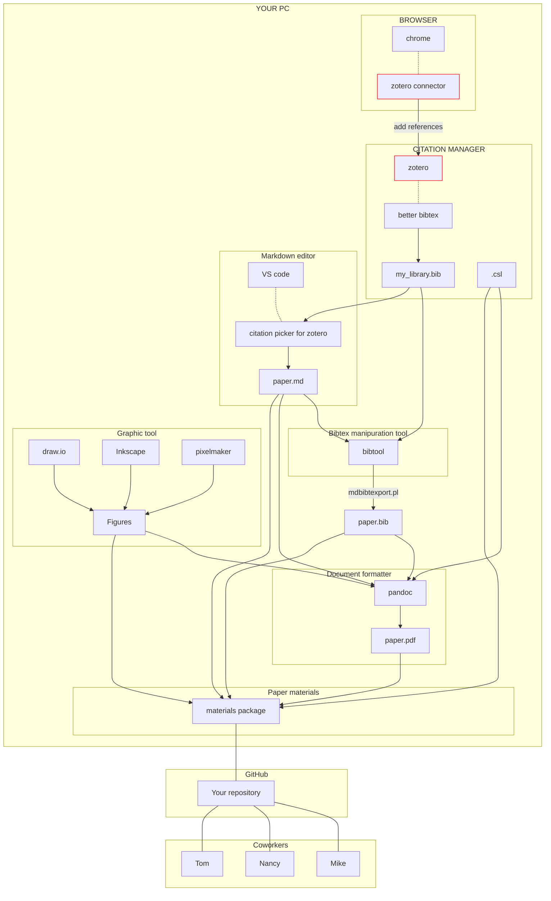

# writing paper

```mermaid
graph TB
subgraph YOUR PC

subgraph BROWSER
A[chrome]-.-B[zotero connector]
click B "https://www.zotero.org/support/connector"
end

subgraph CITATION MANAGER
C[zotero]-.-D[better bibtex]
click C "https://www.zotero.org"
D-->E[my_library.bib]
I[<journal>.csl]
end

subgraph Markdown editor
F[VS code]-.-G[citation picker for zotero]
G-->H[paper.md]
end

subgraph Document formatter
J[pandoc]-->BB[paper.pdf]
end

subgraph Bibtex manipuration tool
AA[bibtool]
end

subgraph Graphic tool
M[draw.io]
K[Inkscape]
O[pixelmaker]
M-->P[Figures]
K-->P
O-->P
end

E-->AA
H-->AA
AA-->|"mdbibtexport.pl"|N[paper.bib]
B-->|"add references"|C
E-->G

H-->J
I-->J
P-->J
N-->J

subgraph Paper materials
A3[materials package]
end

H-->A3
I-->A3
P-->A3
N-->A3
BB-->A3

end

subgraph GitHub
A1[Your repository]
end

subgraph Coworkers
A2[Mike]
B2[Nancy]
C2[Tom]
end

A3---A1
A1---A2
A1---B2
A1---C2

style B stroke: red
style C stroke: red
```